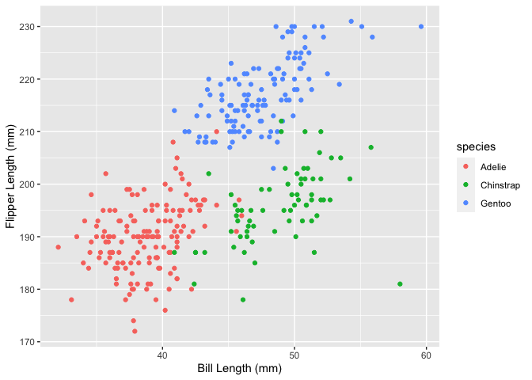

P8105 Homework 1
================
2022-09-21

## Problem 1: Exploratory Data Analysis

In this homework, we will be using the `penguins` dataset from
`palmerpenguins` package.

``` r
data("penguins", package = "palmerpenguins")
```

We can use the `head` function to take a look at the first 5 rows of the
data and to see what variables are present. Using `nrow` and `ncol`, we
can take a look at how many observations and variables are in our
dataset

``` r
head(penguins, 5)
```

    ## # A tibble: 5 × 8
    ##   species island    bill_length_mm bill_depth_mm flipper_l…¹ body_…² sex    year
    ##   <fct>   <fct>              <dbl>         <dbl>       <int>   <int> <fct> <int>
    ## 1 Adelie  Torgersen           39.1          18.7         181    3750 male   2007
    ## 2 Adelie  Torgersen           39.5          17.4         186    3800 fema…  2007
    ## 3 Adelie  Torgersen           40.3          18           195    3250 fema…  2007
    ## 4 Adelie  Torgersen           NA            NA            NA      NA <NA>   2007
    ## 5 Adelie  Torgersen           36.7          19.3         193    3450 fema…  2007
    ## # … with abbreviated variable names ¹​flipper_length_mm, ²​body_mass_g

``` r
nrow(penguins)
```

    ## [1] 344

``` r
ncol(penguins)
```

    ## [1] 8

We can see that the `penguins` dataset has 8 variables and 344
observations. For each penguin, it contains information about the
species, sex, island, year they were recorded, as well as several size
measurements, including bill length and depth, flipper length, and body
mass.

The mean flipper length in the data is 200.9152047 millimeters.

To do further data exploration, we want to graph the relationship
between flipper length and bill length, by penguin species. We can do so
with a scatterplot using `ggplot`.

<!-- -->

## Problem 2
